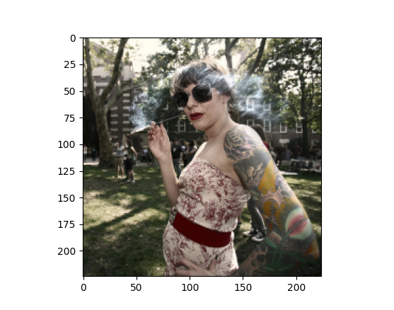

# BW-colorize

## Motivation

The task of colorization is to take a grayscale image and automatically generate a colored version of it. This task is particularly challenging because of the high variability of colors, textures, and other features that may be present in a given image. By implementing a Generative Adversarial Network (GAN) for colorization, we can leverage the power of deep learning to identify features in an image and then generate a realistic-looking colored version. GANs are well-suited for this task because they can learn to generate high-quality images by leveraging a network of two neural networks: a generator and a discriminator. The generator takes in a grayscale image and produces a colored version of it, while the discriminator evaluates whether the generated image is realistic. By training these networks together, we can produce a colorized image that is both realistic and visually appealing.

## Dataset
THe dataset was downloaded from kaggle:

https://www.kaggle.com/shravankumar9892/image-colorization

You should notice that the data is already in the lab color space.
They used opencv to convert the images to lab color space.

Example of the different color spaces:

## How to use (WIP)
### Creation of data
You can run the next command to split the dataset to train, val, test

`python main.py --action split`

Pay attention! it's assume that the dataset is in 

- PROJECT_ROOT/data/raw/l/*

- PROJECT_ROOT/data/raw/ab/* 

directory.

The output will be in `PROJECT_ROOT/data/` directory.

